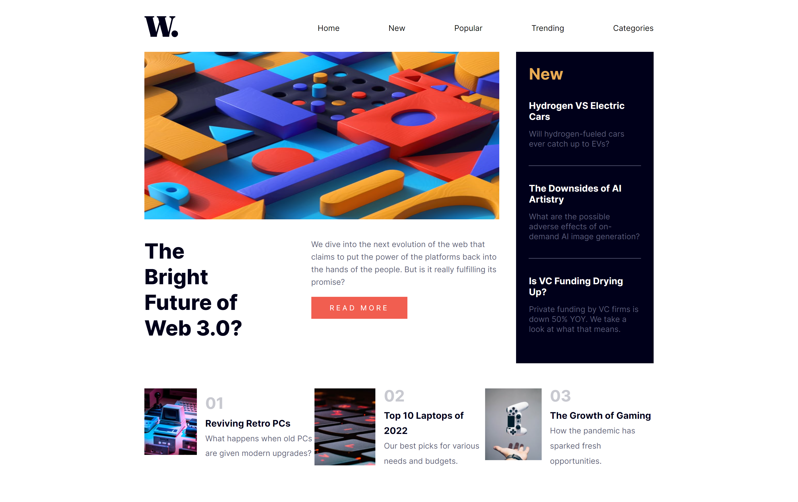
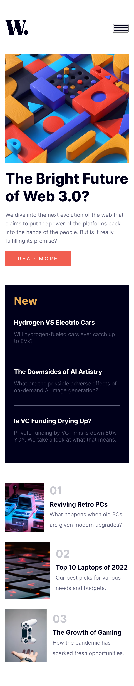
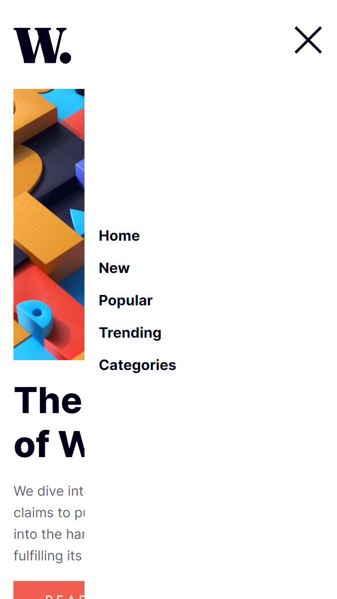

# Frontend Mentor - News-homepage solution

This is one of my old projects that I made and forgot to publish back then.
It is a solution to the [News homepage challenge on Frontend Mentor](https://www.frontendmentor.io/challenges/news-homepage-H6SWTa1MFl).

## Table of contents

- [Overview](#overview)
  - [Built with](#built-with)
  - [Links](#links)
  - [Screenshot](#screenshot)

## Overview

### Built with

- HTML
- CSS
- JavaScript

### Links

- [Live Site URL](https://zsolt270.github.io/News-homepage/)

### Screenshot

